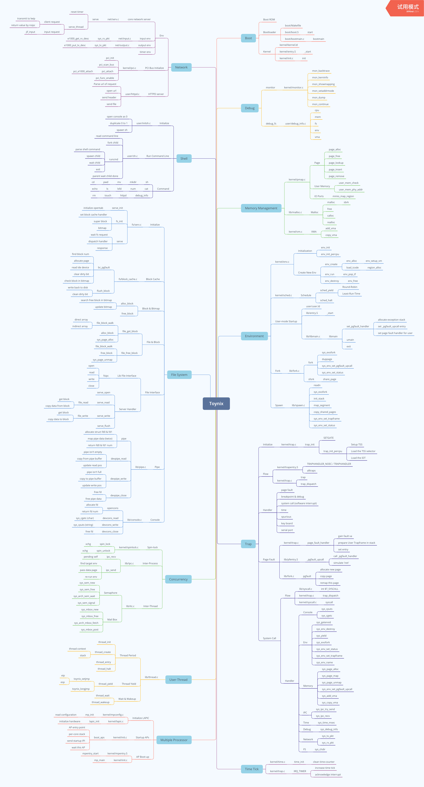
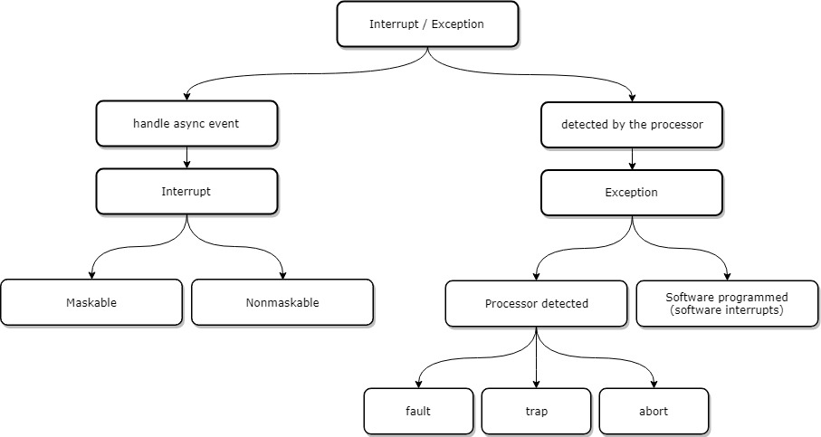
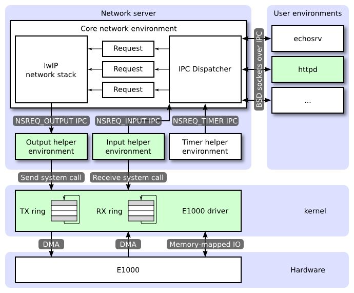

# Toynix

## 1 Boot

### 1.1 x86 Boot ROM

start pa: 0xffff0

### 1.2 Bootloader

start pa: 0x7c00

file: boot/Makefile
> point out entry of bootloader

~~~ Makefile
ld -e start -Ttext 0x7C00
~~~

file: boot/boot.S function: start

1. switch to 32-bit protected mode
2. jump into bootmain

file: boot/bootmain.c function: bootmain

1. load elf file, include elf header & program headers
2. jump into kernel entry

### 1.3 Kernel

start pa: 0x00100000 va: 0xF0100000

file: kernel/kernel.ld
> point out entry of kernel

~~~ ld
ENTRY(_start)

    . = 0xF0100000;
    .text : AT(0x100000) {
        ...
    }
~~~

file: kernel/entry.S function: _start

1. load entry_pgdir into cr3 and turn on paging
2. initialize kernel stack(8 pages) in data segment
3. call init

file: kernel/init.c function: init

1. initialize bss segment
2. initialize console devices including CGA, keyboard and serial port (cons_init)
3. initialize memory ([mem_init](#Memory-Management))
4. initialize task ([env_init](#Environment))
5. initialize trap ([trap_init](#Trap))
6. initialize multiprocessor (mp_init)
7. initialize interrupt controller (lapic_init & pic_init)
8. initialize clock (time_init)
9. initialize PCI bus (pci_init)
10. lock kernel before waking up non-boot CPUs (boot_aps)
11. start file system server (fs serve)
12. start network server (net serve)
13. start init process (user initsh)

## 2 Monitor

file: kernel/monitor.c

### 2.1 Trace of Stack

function: mon_backtrace
> Display the trace of function call

1. read & load ebp
2. gain eip according to ebp
3. parse eip from STAB file, call debuginfo_eip
    a. source from kernel/user
    b. file
    c. function
    d. line

~~~
            +---------------+
            |   arg n       |
            +---------------+
            |   arg 2       |
            +---------------+
            |   arg 1       |
            +---------------+
            |   ret %eip    | caller function's stack frame
            +===============+
            |   saved %ebp  | callee function's stack frame
%ebp -->    +---------------+ <-- where Prologue & Epilogue happen
            |   local       |
            |   variables,  |
%esp -->    |   etc.        |
            +---------------+
~~~

## 3 Memory Management

### 3.1 Initialize

file: kernel/pmap.c function: mem_init

1. detect available physical memory size
2. allocate kern_pgdir by simplified allocator(boot_alloc)
3. setup user page tables (UVPT, read only)
4. allocate page array
5. allocate env array
6. initialize page array
7. map page array to user (UPAGES, read only)
8. map env array to user (UENVS, read only)
9. map [KERNBASE, 2^32) to kernel
10. map kernel stack array to kernel (KSTACKTOP)
11. load kern_pgdir into cr3 register
12. enable paging by loading cr0 register

### 3.2 Page Management

file: kernel/pmap.c

function: page_alloc
> Allocates a physical page

function: page_free
> Return a page to the free list

function: page_lookup
> Return the page mapped at specific virtual address

function: page_insert
> Map the physical page at specific virtual address

function: page_remove
> Unmap the physical page at specific virtual address

1. look up physical page by va
2. decrease page ref count
3. invalidate TLB entry

### 3.3 User Memory

function: user_mem_check
> Check that an environment is allowed to access the range of memory with specific permission

function: user_mem_phy_addr
> transfer user address into physical address

### 3.4 IO Ports

function: mmio_map_region
> Reserve size bytes in the MMIO region and map [pa,pa+size) at this location with PTE_PCD & PTE_PWT bit (cache-disable and write-through)

### 3.5 Malloc

file: lib/malloc.c
> buddy allocator + page reference + copy-on-write + zero page

function: malloc
function: free

## 4 Environment

### 4.1 Initialize

file: kernel/pmap.c

function: env_init
> Initialize all of the Env structures in the envs array and add them to the env_free_list

function: env_init_percpu
> Configure the segmentation hardware with separate segments for privilege level 0 (kernel) and privilege level 3 (user)

### 4.2 Create New Environment

function: env_setup_vm
> Initialize the kernel virtual memory layout for environment e

function: region_alloc
> Allocate len bytes of physical memory for environment env and map it at va

function: load_icode
> Parse an ELF binary image and load its contents into the user address space

1. switch env_pgdir
2. load ELF image
3. set tf_eip
4. initial stack by mapping one page
5. switch back to kern_pgdir

function: env_alloc
> Allocates and initializes a new environment

1. call env_setup_vm
2. initialize Trapframe register

function: env_create
> Allocate an environment with env_alloc and call load_icode to load an ELF binary into it

function: env_run
> Start a given environment running in user mode

1. set current env as spending
2. set target env as running
3. switch env_pgdir
4. unlock kernel before returning to user
5. call env_pop_tf

function: env_pop_tf
> Restores the register values in the Trapframe with the 'iret' instruction

function: env_destroy
> Free specific environment

1. set env status as ENV_DYING
2. in next schedule, call env_free
3. schedule

function: env_free
> Free the env and all memory it uses

1. switch page dir
2. remove pages and page tables of user land
3. free the page dir
4. set env free and add it into free list

### 4.3 Schedule

file: kernel/sched.c

function: sched_yield
> Choose a user environment to run and run it

1. select a suspending env by specific strategy and run it
    a. `Round-Robin` strategy
    b. `Least-Run-Time` strategy
2. if there is no other runnable task, run current task
3. if no task, then halt this CPU (sched_halt)

function: sched_halt
> Halt this CPU when there is nothing to do

1. set current env as NULL
2. switch to kern_pgdir
3. set CPU status as halted
4. unlock kernel
5. clean stack & restore interrupt & halt this CPU (until next interrupt comes)

### 4.4 User-mode Startup

start va: 0x800020

file: user/user.ld
> point out entry of user programs

~~~ ld
ENTRY(_start)

    . = 0x800020;
~~~

file: lib/entry.S
function: _start
> enter C program

1. detect stack, if no arguments, then push 0
2. call libmain

file: lib/libmain.c
function: libmain

1. set page fault handler (handle user stack page)
2. call 'main' entry of user program
3. exit by self

### 4.5 Fork

file: lib/fork.c

function: fork
> User-level fork with copy-on-write.

1. generate new blank env (sys_exofork)
2. duplicate pages in user space (duppage)
3. set page fault handler for child
4. set env as ENV_RUNNABLE

function: sfork
> User-level fork with shared-memory.

1. generate new blank env (sys_exofork)
2. share pages with child
3. duplicate pages in user stack area (duppage)
4. set page fault handler for child
5. set env as ENV_RUNNABLE

function: duppage
> duplicate page in copy-on-write strategy

1. share PTE_SHARE pages directly
2. adopt copy-on-write strategy on pages set with PTE_W or PTE_COW
3. share read-only pages directly

### 4.6 Spawn

file: lib/spawn.c
function: spawnl
> taking command-line arguments array directly on the stack

function: spawn
> Spawn a child process from a program image loaded from the file system

1. open user program image in read-only way
2. create child env
3. initialize stack (init_stack)
4. read ELF program segments and map them (map_segment)
5. copy shared pages
6. set child eip & esp
7. set child ENV_RUNNABLE

function: init_stack
> Set up the initial stack page for the new child process

1. calculate total size of arguments
2. copy argv to temp page
3. map page(and COW zero page) to child's stack

## 5 Trap

### 5.1 Initialize

file: kernel/trap.c

function: trap_init
> set trap, soft interrupt, interrupt handler, and initialize TSS for each CPU, load tss selector & idt

1. set handler in idt
2. load tss & idt in each CPU

### 5.2 Flow

file: kernel/trapentry.S

function: TRAPHANDLER_NOEC TRAPHANDLER
> It pushes a trap number onto the stack, then jumps to alltraps

~~~
    save the user running state

    cross rings case:
    +--------------------+ KSTACKTOP
    | 0x00000 | old SS   |     " - 4
    |      old ESP       |     " - 8
    |     old EFLAGS     |     " - 12
    | 0x00000 | old CS   |     " - 16
    |      old EIP       |     " - 20
    |     error code     |     " - 24
    +--------------------+ <---- ESP
    |      trap num      |     " - 28
    +--------------------+

    non-cross rings case:
    +--------------------+ <---- old ESP
    |     old EFLAGS     |     " - 4
    | 0x00000 | old CS   |     " - 8
    |      old EIP       |     " - 12
    +--------------------+
~~~

function: alltraps
> generate struct Trapframe and call trap with argument Trapframe

~~~
    +--------------------+ KSTACKTOP
    | 0x00000 | old SS   |     " - 4
    |      old ESP       |     " - 8
    |     old EFLAGS     |     " - 12
    | 0x00000 | old CS   |     " - 16
    |      old EIP       |     " - 20
    |     error code     |     " - 24
    +--------------------+
    |      trap num      |     " - 28
    +--------------------+
    |       old DS       |
    |       old ES       |
    |  general registers |
    +--------------------+ <---- ESP
~~~

file: kernel/trap.c

function: trap
> handle the exception/interrupt

1. lock kernel if this CPU is halted before
2. lock kernel if this task comes from user land
3. dispatch based on the type of trap (trap_dispatch)
4. schedule

function: trap_dispatch
> dispatch based on trap num

1. [page fault](#Page-Fault)
2. breakpoint & debug
3. [system call](#System-Call)
4. [time](#Time-Tick)
5. spurious
6. key board
7. serial port

### 5.3 Page Fault

file: kernel/trap.c
function: page_fault_handler
> handle page fault signal in kernel

1. gain fault va
2. check this incident come from user
3. prepare User Trapframe in stack
4. set eip as _pgfault_upcall and return to user (env_run)

file: lib/pfentry.S
function: _pgfault_upcall
> call user handler and restore original field

1. call _pgfault_handler (means pgfault)
2. simulate 'iret' and return to trap point

~~~
already in exception stack case:
+-----------------------+
| Exception Stack n     |
+-----------------------+ <--- esp
| trap-time eip         |
+-----------------------+
| Exception Stack (n+1) |
+-----------------------+

first time trap into exception stack case:
+-------------------+            +-------------------+
| Regular Stack     |            | Exception Stack 1 |
+-------------------+ <--- esp   +-------------------+
| trap-time eip     |
+-------------------+
~~~

file: lib/fork.c
function: pgfault
> handle page fault accident in user

1. check faulting access:
    a. write operation
    b. copy-on-write page
2. allocate new page
3. copy original page to new one
4. remap this page

file: lib/pgfault.c
function: set_pgfault_handler
> set page fault handler entry

1. allocate exception stack
2. set _pgfault_upcall entry
3. set page fault handler for user

### 5.4 System Call

#### 5.4.1 Flow

file: lib/syscall.c
function: syscall
> generic system call in user, use 'int $T_SYSCALL'

file: kernel/trap.c
function: trap_dispatch
> parse trap num and call the relevant handler in kernel

file: kernel/syscall.c
function: syscall
> dispatches to the correct kernel function

#### 5.4.2 Console

1. sys_cputs: print string
2. sys_cgetc: read a character from the system console

#### 5.4.3 Env

1. sys_getenvid: returns the current environment's envid
2. sys_env_destroy: [env_destroy](#Create-New-Environment)
3. sys_yield: [schedule](#Schedule)
4. sys_exofork: [fork](#Fork)
5. sys_env_set_status: set the status of a specified environment (ENV_RUNNABLE or ENV_NOT_RUNNABLE)
6. sys_env_set_trapframe: set env's eip & esp (enable interrupts, set IOPL as 0)

#### 5.4.4 Memory

1. sys_page_alloc: allocate a page of memory and map it at 'va' with permission
2. sys_page_map: map the page of memory at 'src va' in src env's address space at 'dst va' in dst env's address space with permission 'perm'
3. sys_page_unmap: unmap the page of memory at 'va' in the address space of 'env'
4. sys_env_set_pgfault_upcall: [set the page fault upcall](#Page-Fault)

#### 5.4.5 IPC

1. sys_ipc_try_send: try to send 'value' to the target env 'envid' ([IPC](#Inter-Process-Communication))
2. sys_ipc_recv: block until a value is ready ([IPC](#Inter-Process-Communication))

#### 5.4.6 Time

1. sys_time_msec: gain time, unit: millisecond ([Time Tick](#Time-Tick))

#### 5.4.7 Debug

1. sys_debug_info: gain info of CPU & memory

#### 5.4.8 Network

1. sys_tx_pkt: transmit packet to e1000 ([Network](#Network))
2. sys_rx_pkt: receive packet from e1000 ([Network](#Network))

#### 5.4.9 FS

1. sys_chdir: switch working dir of current env

## 6 Tick

file: kernel/time.c
function: time_init
> clean time-counter

file: kernel/trap.c
function: trap_dispatch

* when receives IRQ_TIMER:
    1. increase time tick (if this CPU is boot one)
    2. acknowledge interrupt
    3. schedule

## 7 Multiple Processor

### 7.1 Initialize LAPIC

file: kernel/mpconfig.c
function: mp_init
> gain local APIC base address from BIOS(Basic Input Output System) or EBDA(Extended BIOS Data Area)

file: kernel/lapic.c
function: lapic_init
> map LAPIC base address and initialize the local APIC hardware

### 7.2 Startup APs

file: kernel/init.c
function: boot_aps
> start the non-boot processors(AP)

1. copy mpentry_start to AP entry point
2. figure out per-core kernel stack
3. send startup IPI(Inter-Processor Interrupts) to boot up (lapic_startap)
4. wait until this AP is started

### 7.3 AP Boot-up

start pa: 0x7000

~~~ C
#define MPENTRY_PADDR 0x7000

code = KADDR(MPENTRY_PADDR);
lapic_startap(c->cpu_id, PADDR(code));
~~~

file: kernel/mpentry.S
function: mpentry_start

1. turn on protection mode
2. turn on paging (load entry_pgdir)
3. switch to the per-cpu stack
4. call mp_main

file: kernel/init.c
function: mp_main

1. load kern_pgdir
2. initialize local APIC
3. load GDT and segment descriptors
4. initialize and load the per-CPU TSS and IDT
5. set CPU status
6. lock kernel for making sure only one process can enter the scheduler
7. schedule

## 8 Thread

### 8.1 Thread Period

file: lib/thread.c

function: thread_init
> initialize thread-queue

function: thread_create

1. allocate thread context, thread id, stack
2. set thread esp & eip(thread_entry), entry & arg
3. push this thread into thread-queue
4. return thread id

function: thread_entry

1. call tc_entry with tc_arg
2. exit by thread_halt

function: thread_halt

1. pop one element from kill_queue, call hook(tc_onhalt, which set by thread_onhalt) and free resources
2. push self into kill_queue
3. thread yield
4. if no other threads, then the whole env exit

### 8.2 Thread Yield

function: thread_yield

1. pop one element from thread-queue
2. if no other thread, then return
3. store jump point(toynix_setjmp), and push self into thread-queue
4. load thread context and yield(toynix_longjmp)

function: toynix_setjmp
> store current context and return 0

function: toynix_longjmp
> load context and return arg2

### 8.3 Thread Wait & Wakeup

function: thread_wait

1. sleep until:
    * condition no meet
    * already waken up
2. clean wakeup bit

function: thread_wakeup

1. find all of target thread
2. set wakeup bit

## 9 Concurrency

### 9.1 Spin-lock

file: kernel/spinlock.c

function: spin_lock
> acquire the lock

1. detect whether holding by self
2. exchange lock status
3. record info

function: spin_unlock
> release the lock

1. detect whether holding by self, if no holding then print info
2. exchange lock status

file: include/x86.h
function: xchg
> 'xchg' instruction is atomic and x86 CPUs will not reorder loads/stores across 'lock' instructions

~~~ C
asm volatile("lock; xchgl %0, %1"
            : "+m" (*addr), "=a" (result)
            : "1" (newval)
            : "cc");
~~~

### 9.2 Inter-Process Communication

file: lib/ipc.c
> User space

function: ipc_recv
> receive a value via IPC and return it, call sys_ipc_recv

function: ipc_send
> Send 'val' to 'env', call sys_ipc_try_send

file: kernel/syscall.c
> Kernel space

function: sys_ipc_recv
> pending self until data is ready

function: sys_ipc_try_send
> try to send 'value' to the target env

1. find target env by env id
2. pass data page
3. restore target env running

### 9.3 Inter-Thread Communication

file: lib/itc.c

function: sys_init
> initialize sems & mboxes, and insert into free list

#### 9.4 Semaphore

function: sys_sem_new

1. get free sem from list
2. set counter number
3. return sem id

function: sys_sem_free
> insert back to free list

function: sys_arch_sem_wait

1. if counter > 0, then request counter and return back
2. if counter = 0, return when:
    * thread wait counter changed
    * sleep until time-out

function: sys_sem_signal

1. post counter
2. if there are someone waiting, then wakeup them([thread_wakeup](#Thread-Wait-&-Wakeup))

#### 9.5 Mail Box

function: sys_mbox_new

1. get a free mailbox
2. allocate semaphores for queued message and free message

function: sys_mbox_free

1. free semaphores
2. insert mailbox back to free list

function: sys_mbox_post

1. wait sem of free msg
2. put msg into mailbox slot
3. update `nextq` of mailbox
4. post sem of queued msg

function: sys_arch_mbox_fetch

1. wait sem of queued msg
2. gain msg from mailbox slot
3. update `head` of mailbox
4. post sem of free msg

## 10 File System

### 10.1 Initialize

file: kernel/init.c
function: ENV_CREATE
> create file system task, and this env can access IO ports

file: fs/serv.c
function: umain

1. initialize opentab (serve_init)
2. set block cache handler, initialize super block & bitmap (fs_init)
3. trigger fs server (serve)

function: serve
> fs server

1. wait fs request
2. dispatch proper handler
3. response to request

### 10.2 Block Cache

file: fs/block_cache.c

function: bc_pgfault
> Fault any disk block that is read in to memory by loading it from disk

1. find block num by page fault va
2. allocate a page
3. read ide device 4 sectors as 1 block(page)
4. clear dirty bit of page by remapping, because we just read from disk and write to memory
5. check the block was allocated in bitmap

function: flush_block
> Flush the contents of the block containing VA out to disk

1. if the block is not cached or is not dirty, then skip
2. write back to disk
3. remap this block for cleaning dirty bit

### 10.3 Block & Bitmap

file: fs/fs.c

function: alloc_block
> Search the bitmap for a free block and allocate it

1. search free block in bitmap
2. get it and set it occupied
3. update bitmap

function: free_block
> Mark a block free in the bitmap

1. reset free bit
2. update bitmap

### 10.4  File & Block

function: file_get_block
> Set *blk to the address in memory where the filebno'th block of file 'f' would be mapped

1. find the block num
2. if not allocated yet, then allocate one and map
3. return va of this block

function: file_free_block
> Remove a block from file

function: file_block_walk
> Find the disk block number slot for the 'filebno'th block in file 'f'

1. find block from direct array
2. find block from indirect array

### 10.5 Regular File Interface

~~~
      Regular env           FS env
   +---------------+   +---------------+
   |      read     |   |   file_read   |
   |   (lib/fd.c)  |   |   (fs/fs.c)   |
...|.......|.......|...|.......^.......|.........................
   |       v       |   |       |       |      RPC mechanism
   |  devfile_read |   |  serve_read   | (Remote Procedure Call)
   |  (lib/file.c) |   |  (fs/serv.c)  |
   |       |       |   |       ^       |
   |       v       |   |       |       |
   |     fsipc     |   |     serve     | User Space
   |  (lib/file.c) |   |  (fs/serv.c)  |
   |       |       |   |       ^       |
   |       v       |   |       |       |
   |   ipc_send    |   |   ipc_recv    |
   |       |       |   |       ^       |
   +-------|-------+   +-------|-------+
           |    Kernel Space   |
           +-------------------+

               +--------------------+
               |  struct OpenFile   |
               | (max 1024 at once) |
               +--------------------+
                          |
                          |
        +-----------------+-----------------+
        |                                   |
        |                                   |
        V                                   V
+-----------------+     +-----------------------------------------+
|   struct File   |     |       struct Fd (file descriptor)       |
|  file meta-data |     | associate with process (max 32 per env) |
+-----------------+     +-----------------------------------------+
~~~

#### 10.5.1 Lib File Interface

file: lib/file.c
function: fsipc
> Send an inter-environment request to the file server, and wait for a reply

file: lib/file.c
function: open

1. allocate struct fd
2. send fd to fs server (fsipc)
3. return fd num

file: lib/fd.c
function: read write

1. find fd by fd num
2. find device by device-id of fd
3. call read/write function of device(devfile_read/devfile_write)

file: lib/fd.c
function: close

1. find fd by fd num
2. call close function of device(devfile_flush)
3. free fd

#### 10.5.2 Server Handler

file: fs/serv.c
function: serve_open

1. find a free open file, and return file-id(openfile_alloc)
2. if file not exist, then create
3. open struct File from disk (call file_open)
4. initialize struct Fd
5. send back struct Fd

function: serve_read serve_write

1. find struct open file by file-id
2. call file_read/file_write
3. update offset

function: serve_flush

1. find struct open file by file-id
2. flush file (call flush_block)

#### 10.5.3 File System Operation

function: file_read/file_write

1. get specific block
2. copy data from/to block cache by fs

### 10.6 Pipe

file: lib/pipe.c

function: pipe
> open pipe read/write sides

1. allocate struct fd0 & fd1
2. map pipe data (twice)
3. return fd0 & fd1 num

function: devpipe_read

1. if pipe is empty(read pos == write pos)
    a. if no writers, then return
    b. or yield
2. copy from pipe buffer
3. update read pos

function: devpipe_write

1. if pipe is full(write pos >= read pos + sizeof(pipe buf))
    a. if no readers, then return
    b. or yield
2. copy to pipe buffer
3. update write pos

function: devpipe_close

1. free fd
2. free pipe data

function: pipeisclosed

1. make sure detecting in the same timer interrupt
2. if pageref(fd) equals to pageref(pipe data), then writer/reader is closed already

### 10.7 Console

file: lib/console.c

function: opencons
> allocate fd, and return fd num

function: devcons_read
> call sys_cgetc, get only one character from console

function: devcons_write
> call sys_cputs, put a string to console

function: devcons_close
> free fd

## 11 Shell

### 11.1 Initialize

file: user/initsh.c

1. make sure close fd0
2. open console as 0
3. duplicate 0 to 1 (standard input/output)
4. spawn sh

### 11.2 Run Command Line

file: user/sh.c

1. read command line
2. if 'cd', then need to change workpath
3. fork child
4. child run command
5. parent wait child done

function: runcmd

1. parse shell command
    * 'w': argument
    * '<': input redirection, open file and dup to 0
    * '>': output redirection, open file and dup to 1
    * '|': pipe, fork child, tranfer parent output to child input
    * '&': run background, no need to wait this child process done
    * ';': separate command, need to wait this child process done
2. spawn child
3. close all file descriptors
4. wait child
5. exit

## 12 Network

* core network server
* input env
* output env
* timer env

file: lib/nsipc.c
function: nsipc
> send an IP request to the network server, and wait for a reply

### 12.1 PCI Bus Initialize

file: kernel/pci.c
function: pci_init

function: pci_scan_bus
> read configuration and irq line

function: pci_attach pci_attach_match
> when matches info of device class & vendor, then call `attachfn` to initialize

file: kernel/e1000.c
function: pci_e1000_attach
> initialize e1000 net card

function: pci_func_enable
> allocate resource to this PCI device

### 12.2 E1000 Interface

file: kernel/e1000.c
function: e1000_put_tx_desc
> wait until Descriptor Done, then configure DMA registers, fill descriptor and update `e1000_tdt` pointer

function: e1000_get_rx_desc
> wait until Descriptor Done, then copy data, clean status and update `e1000_rdt` pointer

### 12.3 User Interface

file: lib/syscall.c
function: sys_tx_pkt

1. use `user_mem_assert` checking whether the buffer come from user space
2. if it is the last descriptor, then mark E1000_TXD_CMD_EOP flag
3. call e1000_put_tx_desc, if busy then yield

function: sys_rx_pkt

1. use `user_mem_assert` checking whether the buffer come from user space
2. call e1000_get_rx_desc

### 12.4 Network Output/Input Env

file: net/output.c

1. ipc receive from network server
2. call sys_tx_pkt

file: net/input.c
> When you IPC a page to the network server, it will be reading from it for a while, so don't immediately receive another packet in to the same physical page

1. allocate nsipcbuf
2. call sys_rx_pkt
3. ipc send to network server

### 12.5 Core Net-Server Env

file: net/serv.c

1. setup timer env (as thread's time-scheduler)
2. setup input env
3. setup output env
4. setup thread to run tmain

function: tmain

1. TCP/IP initialize
2. call serve

function: serve

1. wake up all threads
2. receive requests
3. if it's timer request, then schedule other threads and reset timer
4. create thread to deal with other type of request (serve_thread)
5. thread yield

function: serve_thread

1. if it's request from ns(net-server) client (such as accept, bind, shutdown, close):
    1. transmit to lwip stack
    2. send back return-value by ipc_send
2. if comes from input env, call jif_input

### 12.6 HTTPD server

file: user/httpd.c

1. Receive message from client
2. Parse url & version of request
3. open url
4. if file no exist or is dir, then send back 404
5. send header
6. send file size
7. send content type (e.g. text/html)
8. send header fin
9. send data of file

~~~
Request:
GET www.url.com/index.html V1.0
~~~

~~~
Response:
HTTP/1.0 200 OK
Server: jhttpd/0.1
Content-Length: 123
Content-Type: text/html

"Content of File"
~~~
